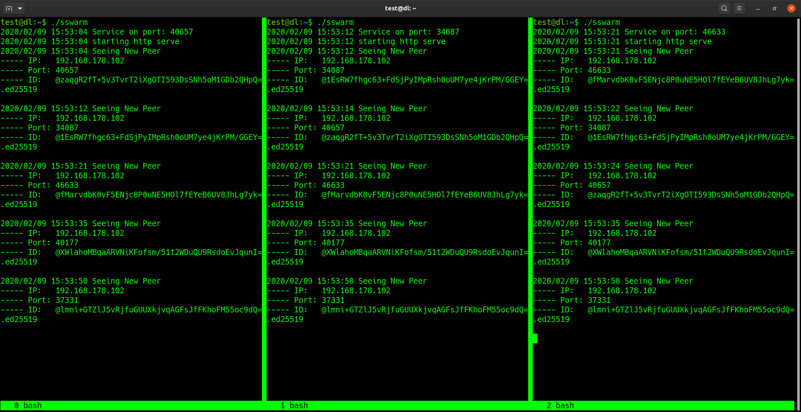

# Simple Swarm

this is a practice in UDP Multicasting

---
a basic server would look something like this:
```golang
conn, _ := net.ListenMulticastUDP("udp", nil, 
    &net.UDPAddr{
        IP: []byte{239, 255, 255, 19},
        Port: 25519,
    },
)
defer conn.Close()
b := []byte{}
conn.ReadFromUDP(b)
```
a basic client would look something like this:
```golang
conn, _ := net.DialUDP("udp", nil,
    &net.UDPAddr{
        IP:   []byte{239, 255, 255, 19},
        Port: 25519,
    },
)
defer conn.Close()
conn.Write([]byte("somebytes")
```

## swarm

as each instance of this is executed on the network (or on the same computer), every 5 seconds the instance broadcasts a UDP packet containing a newly generated public key, a random service port, and consequentially its own ip address from the IP packet.
each time an instance receives a UDP multicast packet, it checks the new peer's public key against a map, if its a newly found peer, it will log it to stdout, and add it to the map in memory.

## demo

1. `git clone` this project
2. use `./build.sh` to build in docker, or just use `go build`
3. open up a few terminals and run `./sswarm` in each terminal




